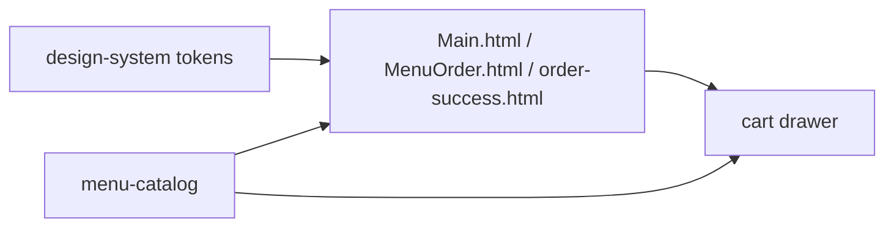
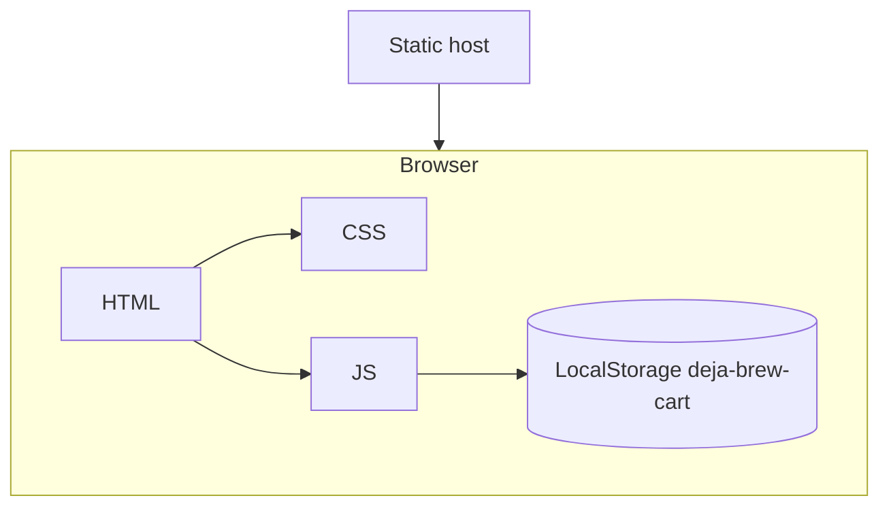

# Architecture Spine — Enhanced Deja Brew

## Design Paradigm

**Static-site + Progressive Enhancement.** HTML is the source of truth and renders fully without JS. JS is an enhancement layer for tabs/filters, scroll-progress, mood recommendation, and the LocalStorage cart drawer — never required for core browse or the canonical `Order Now → order-success.html` link. One way this earns its keep: CAP-1/CAP-2/CAP-3 remain testable by opening `Main.html` with JS disabled, while CAP-4/CAP-6 degrade gracefully.

## Invariants & Rules

### AD-1 — Static-site + Progressive Enhancement

- **Binds:** all
- **Prevents:** JS-only rendering divergence where two stories require JS for baseline content and the site breaks with scripts off.
- **Rule:** Every page renders its primary content (hero, menu grid, values, contact, success copy) in static HTML; JS may only enhance (filter, progress width, cart drawer transform, recommendation). No JS framework, no build step.

### AD-2 — Dependency direction (catalog → pages → interactions)

- **Binds:** CAP-3, CAP-4, CAP-5, CAP-6
- **Prevents:** Circular dependencies where cart and catalog each import the other, or pages import cart and create two owners of item shape.
- **Rule:** `design-system` → `pages` → `interactions`. `menu-catalog` is read-only source (rendered as `data/catalog.js` or inline JSON); pages may read catalog, catalog never reads pages; cart depends on catalog + `localStorage`, nothing depends on cart. Validated by import graph: no page → cart → catalog cycle.



### AD-3 — Single owner for state

- **Binds:** CAP-4, CAP-6
- **Prevents:** Two writers to cart (e.g., mood picker and menu both mutating storage with different shapes) causing lost quantities.
- **Rule:** Catalog is immutable; cart state is owned solely by the `cart` module via `localStorage` key `deja-brew-cart: [{id, qty}]`. Mood picker and menu interact with cart only through `cart.add(id)` / `cart.update(id, qty)`. No direct `localStorage` writes elsewhere.

### AD-4 — Single routing surface

- **Binds:** CAP-2, CAP-3, CAP-6
- **Prevents:** Route sprawl where each story invents a new HTML page (`MenuCoffee.html`, `Pastries2.html`) and nav diverges.
- **Rule:** Exactly four navigable documents (amended 2026-08-27 Horizon B): `Main.html` (hero + values + featured + #about + origin map + brew guide), `MenuOrder.html` (unified menu; was `CoffeeOrder.html`+`BakeryOrder.html`), `order-success.html`, `404.html` (warm editorial not-found). `About.html` becomes `#about` anchor; nav `href` stays sibling-HTML (`MenuOrder.html`, `Main.html#about`). New route requires AD amendment.

### AD-5 — Single styling source

- **Binds:** CAP-1
- **Prevents:** Style drift where one story writes inline styles, another adds a second CSS file, breaking palette at 768px.
- **Rule:** One `style.css` plus `design-system.md` tokens (`#E8DAB2/#333/#f0a500/#FFF8F0`, Playfair+Inter, 220px images, 12px/16px radii, shadows). JS never injects styles except `style.width` for progress and `transform` for drawer. All colors pull from tokens.

## Consistency Conventions

| Concern | Convention |
| --- | --- |
| Naming (entities, files, interfaces, events) | Files `kebab-case.html` + exact image casing (`Kwasant.jpg`); IDs `M-C-01`/`M-P-01` from catalog; JS modules `catalog.js`, `cart.js`, `filters.js`; events `cart:updated` |
| Data & formats (ids, dates, error shapes, envelopes) | Prices `₱` + `*.2f` PHP; LocalStorage JSON array; no dates in v1; errors are silent UI (empty cart) |
| State & cross-cutting (mutation, errors, logging, config, auth) | Cart mutations only via `cart.js`; no auth; console warn on bad ID, never throw; config is inline constants, no env file |

## Stack

| Name | Version |
| --- | --- |
| HTML | HTML5 |
| CSS | CSS3 (single style.css) |
| JavaScript | Vanilla ES2020 (modules) |
| Storage | Window LocalStorage |
| Hosting | Static (GitHub Pages / Netlify static / `npx serve`) |
| Icons | Font Awesome 6 CDN |

## Structural Seed

```
Enhanced Deja Brew/
  Main.html              # hero split dark, values ribbon, featured, #about, origin map + brew guide, contact
  MenuOrder.html         # unified menu: tabs All|Coffee|Pastry, filters (price/roast/sort/faves), pill prices
  order-success.html     # well-formed Home anchor + cross-sell + receipt
  404.html               # warm editorial not-found (AD-4 amendment Horizon B)
  style.css              # tokens + layout + 768px switch
  data/
    catalog.js           # export const catalog = [...] from menu-catalog.md + review
  js/
    filters.js           # tabs + tags + search + mood + price/roast/sort/origin/faves
    cart.js              # LocalStorage owner deja-brew-cart
    faves.js             # LocalStorage owner deja-brew-faves
    progress.js          # scroll-width bar
    nav.js               # hamburger + drawer a11y
  *.jpg/.jpeg/.png       # co-located images, exact casing
  _bmad-output/
    specs/spec-enhanced-deja-brew/
    planning-artifacts/architecture/
```



## Capability → Architecture Map

| Capability / Area | Lives in | Governed by |
| --- | --- | --- |
| CAP-1 Warm editorial | Main.html, MenuOrder.html, style.css, design-system.md | AD-5, AD-1 |
| CAP-2 Story-fused scroll | Main.html (#about, values ribbon, hero) | AD-4, AD-1 |
| CAP-3 Unified menu | MenuOrder.html + data/catalog.js + js/filters.js | AD-2, AD-3, AD-4 |
| CAP-4 Nav + cart | js/progress.js, js/cart.js + style.css | AD-2, AD-3, AD-5 |
| CAP-5 Enriched catalog | menu-catalog.md → data/catalog.js + footer | AD-2, AD-3 |
| CAP-6 Mood + success | js/filters.js (mood) + order-success.html | AD-2, AD-3, AD-4 |

## Deferred

- Choice of `catalog.js` as ES module vs inline JSON script tag — can wait until story 3 lands, no divergence risk.
- Build-time vs hand-maintained `catalog.js` sync from `menu-catalog.md` — defer to implementation; invariant is that catalog is source of truth, not its generation.
- Animation detail (easing, drawer timing) — defer to story polish, not an invariant.
- Full deployment pipeline (CI) — operational envelope deferred; static host assumption holds for now.
